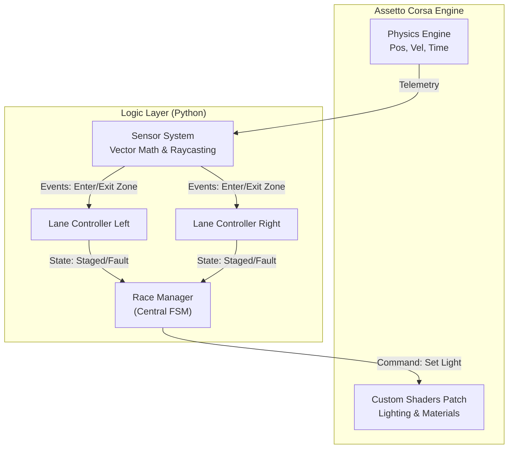
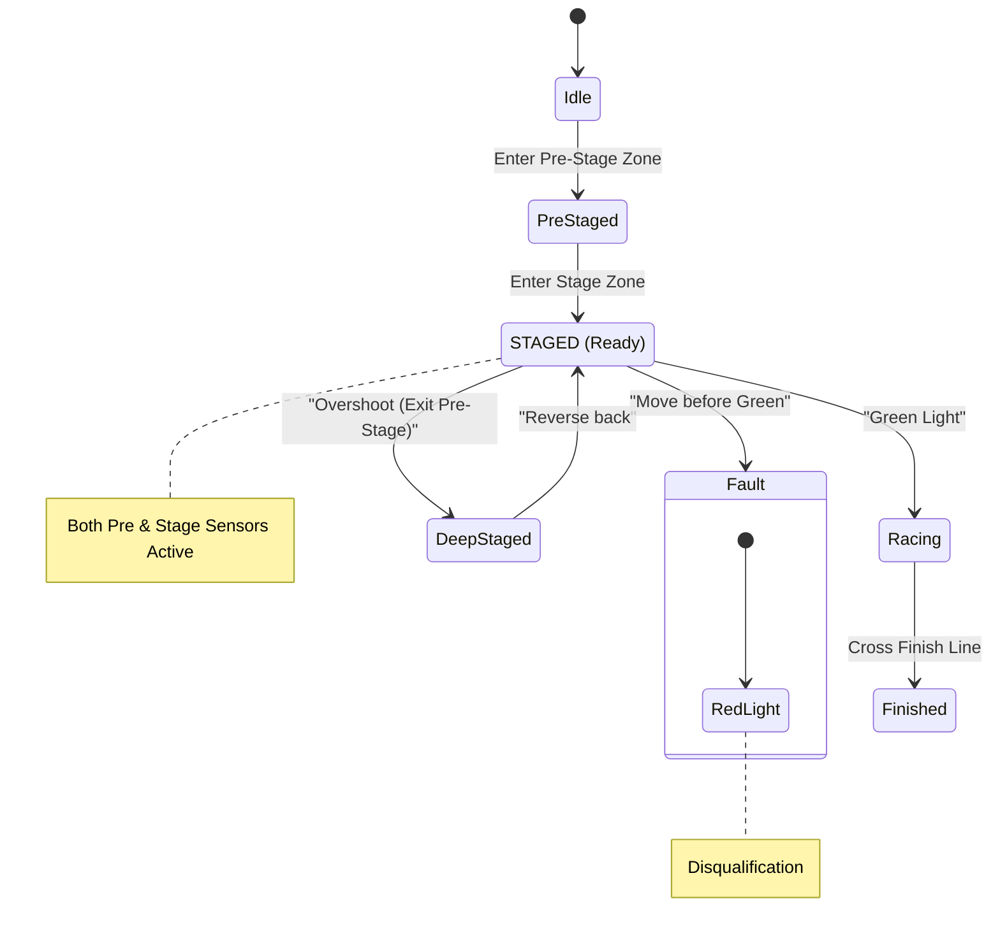
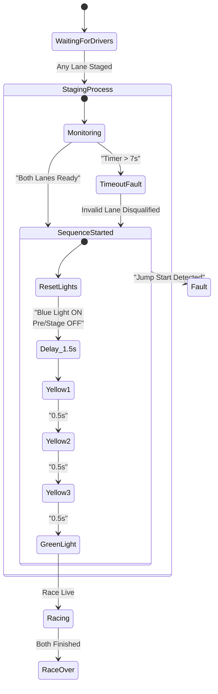

# 🚦 Pinheirinho Drag Race System
> **Technical Specification**: State Machines, Logic Flows & System Architecture

This document details the engineering logic behind the Assetto Corsa Drag Race Mod ("Pinheirinho"). Ideally, this serves as the "source of truth" for the system's behavior, covering the Finite State Machines (FSM), Sensor Logic, and Race Sequences.

---

## 🏛️ System Architecture

The system follows a **Component-Based Architecture** designed for high performance within the Assetto Corsa Python environment. To ensure zero-latency feedback (crucial for drag racing), we bypass traditional disk I/O in favor of direct memory manipulation for lighting control.

---

## 🧠 Finite State Machines (FSM)

The system is governed by two interacting State Machines: the **Lane Controller** (one per car) and the **Race Manager** (Global Orchestrator).

### 1. Lane Controller Logic
*Responsible for tracking individual car position and alignment.*

*   **Inputs**: Virtual Sensors (Pre-Stage Zone, Stage Zone).
*   **Goal**: Achieve strict `STAGED` status (Both Sensors Active).
*   **Rules**: 
    *   **Deep Stage**: If a driver rolls past the Pre-Stage beam (leaving only Stage active), they are **NOT READY**. They must reverse.
    *   **Jump Start**: Any movement (Speed > Threshold) during the Tree Sequence triggers an immediate **FAULT**.

---

### 2. Race Manager Logic
*Responsible for the race sequence, timing, and rules enforcement.*

*   **The 7-Second Rule**: Once the *first* driver is fully STAGED, a 7-second countdown begins. If the opponent fails to stage within this window, they are disqualified (Timeout).
*   **Sequence (Sportsman Tree)**: 
    *   1.5s Initial Delay
    *   0.5s Intervals between Yellows (Cascading)
    *   Green Light

---

## 🌊 System Flows

### 🏁 User Flow: The Perfect Start (Happy Path)
1.  **Approach**: Driver slowly approaches the line.
2.  **Pre-Stage**: First amber light on dashboard/tree lights up. Driver knows they are close.
3.  **Stage**: Driver creeps forward inches until the second amber light turns on.
    *   *Visual*: Both Pre-Stage and Stage bulbs are ON.
4.  **Hold**: Driver holds the brake/clutch. Velocity must be absolute zero.
5.  **Sequence**:
    *   Opponent stages.
    *   **Sequence Start**: Pre-Stage & Stage lights extinguish. Blue light (if equipped) turns ON.
    *   **Tree Countdown**: Yellow 1 -> Yellow 2 -> Yellow 3 (0.5s intervals).
6.  **Launch**: On the transition from Yellow 3 to Green, driver accelerates.

### 🚫 Exception Flow: The "Deep Stage" Error
1.  **Overshoot**: Driver creeps too far, passing the first sensor beam.
2.  **Feedback**: Pre-Stage light turns **OFF**, leaving only Stage light ON.
3.  **System State**: The system considers the driver **NOT READY**.
4.  **Correction**: Driver puts car in Reverse and backs up slightly until Pre-Stage lights up again.

### ⚡ Exception Flow: The 7-Second Timeout
1.  **Trigger**: Driver A stages successfully. Driver B is still maneuvering.
2.  **Countdown**: System starts invisible 7s timer.
3.  **Violation**: Timer hits 0s and Driver B is still not staged.
4.  **Penalty**: Driver B receives an immediate **RED LIGHT**.
5.  **Result**: Driver A effectively wins (Solo Run/Bye Run), provided they don't foul their own run.

---

## 🛠️ Technical Implementation Details

| Feature | Implementation Strategy |
| :--- | :--- |
| **Pneus vs Chassis** | We calculate the position of the **Front Wheels** (using vector offsets), not the car center, to simulate physical beam breaking accurately. |
| **Lighting Performance** | **Direct Memory Access (DMA)** via Custom Shaders Patch API. We modify the material emissivity properties in RAM, avoiding the stutter caused by disk file writes (`.ini`). |
| **Precision** | **Vector Math** (Dot Product) is used to project the car's position onto the track spline, ensuring accurate detection even if the car is slightly diagonal. |
